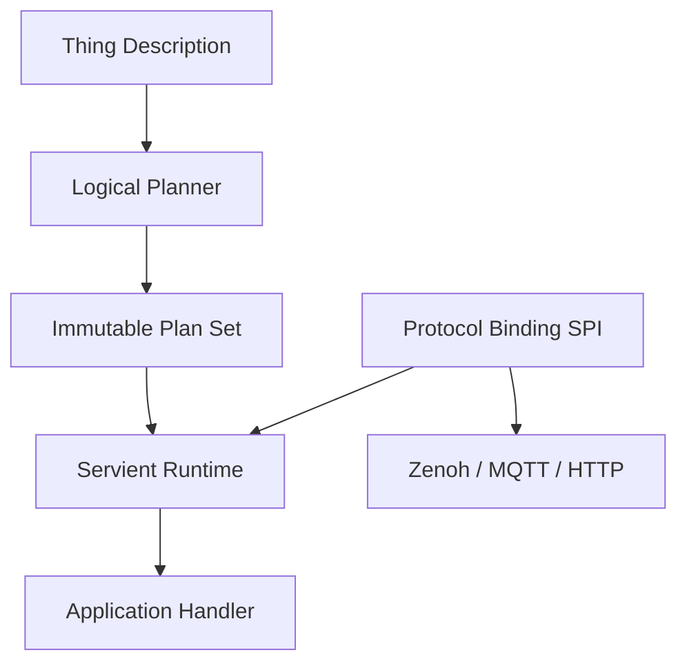

# clinkz-wot

<div align="center">

## A protocol-neutral Rust Web of Things runtime

**Simple Links. Infinite Possibilities.**

A Rust implementation of the W3C WoT programming model with semantic interaction contracts and pluggable Protocol Bindings.

[](https://www.rust-lang.org/)
[](https://www.w3.org/WoT/)
[](LICENSE)

</div>

---

## Overview

`clinkz-wot` is a **protocol-neutral Web of Things runtime** built in Rust.

It implements the W3C WoT programming model by separating:

* **Thing semantics** — what a Thing provides
* **Runtime execution** — how interactions are managed
* **Protocol bindings** — how messages are transported

The runtime works with **Things, not protocols**.

A Thing Description (TD) defines the semantic contract, while Protocol Bindings provide communication capabilities.

```
Thing Description
        |
        v
+----------------+
|    Planner     |
+----------------+
        |
        v
+----------------+
| Compiled Plans |
+----------------+
        |
        v
+----------------+
|   Servient     |
|    Runtime     |
+----------------+
        |
        v
 Application

        ^
        |
 Protocol Binding SPI
        |
        v
 Zenoh / MQTT / HTTP ...
```

---

## Core Architecture



### Runtime ownership model

The **Servient owns execution**.

Protocol Bindings only handle protocol-specific concerns:

* message receiving and sending
* serialization
* addressing
* transport sessions
* protocol-level flow control

They do **not** own:

* application lifecycle
* interaction routing
* handler dispatch
* runtime state management

Message flow:

```
Protocol Message
        |
        v
Protocol Binding
        |
        v
Servient Runtime
        |
        v
Application Handler
```

---

# Design Principles

## Semantic Contract First

The runtime is built around W3C Thing Description.

TD defines:

* Properties
* Actions
* Events
* Data schemas
* Interaction forms

The runtime operates on semantic interactions instead of protocol messages.

---

## Protocol Neutrality

The core runtime has no dependency on any transport.

Supported or planned bindings can include:

* Zenoh
* MQTT
* HTTP
* WebSocket
* other future protocols

Adding a protocol should extend the runtime, not change the runtime model.

---

## Compiled Execution Model

Interaction decisions are prepared before runtime execution.

```
TD
 |
 v
Parse & Validate
 |
 v
Logical Planning
 |
 v
Binding Compilation
 |
 v
Runtime Execution
```

The runtime executes admitted immutable plans instead of repeatedly discovering capabilities during operation.

Benefits:

* predictable behavior
* lower runtime overhead
* clearer lifecycle management
* easier verification

---

# Protocol Binding SPI

Protocol Bindings are extensions of the runtime.

A binding provides:

```
Protocol
   |
   v
Binding Adapter
   |
   v
Protocol-neutral Interaction
   |
   v
Servient Runtime
```

The SPI boundary keeps transport details isolated from WoT semantics.

Current implementation:

* Zenoh binding

Future possibilities:

* MQTT
* HTTP
* WebSocket
* custom transports

---

# Platform Targets

`clinkz-wot` is designed for both host systems and constrained environments.

| Target                         | Status         |
| ------------------------------ | -------------- |
| Standard Rust environments     | Supported      |
| Async runtime integration      | Supported      |
| `no_std + alloc`               | Supported      |
| Embedded constrained execution | In development |

The semantic model remains identical across platforms.

---

# Workspace Structure

```
foundation/
    Ownership and resource foundations

td/
    W3C Thing Description model

core/
    Protocol-neutral runtime contracts

planning/
    Logical planner and capability matching

protocol-bindings/
    Communication integrations

servient/
    Runtime orchestration engine

discovery/
    WoT discovery support

docs/
    Architecture and specifications
```

---

# Current Status

`clinkz-wot` is under active architectural development.

Current focus:

* Servient lifecycle refinement
* Protocol Binding SPI stabilization
* Immutable plan execution model
* Zenoh integration
* architecture documentation

The project is not yet a production release.

Public APIs and module boundaries may continue to evolve.

---

# Documentation

Architecture:

```
docs/architecture/
```

Design specification:

```
docs/design.md
```

Architecture decisions:

```
docs/ADRs/
```

---

# Build

```bash
git clone https://github.com/yushun1990/clinkz-wot.git

cd clinkz-wot

cargo fmt --all --check

cargo test --workspace

cargo clippy --workspace --all-targets --all-features -- -D warnings
```

---

# License

Apache License 2.0
