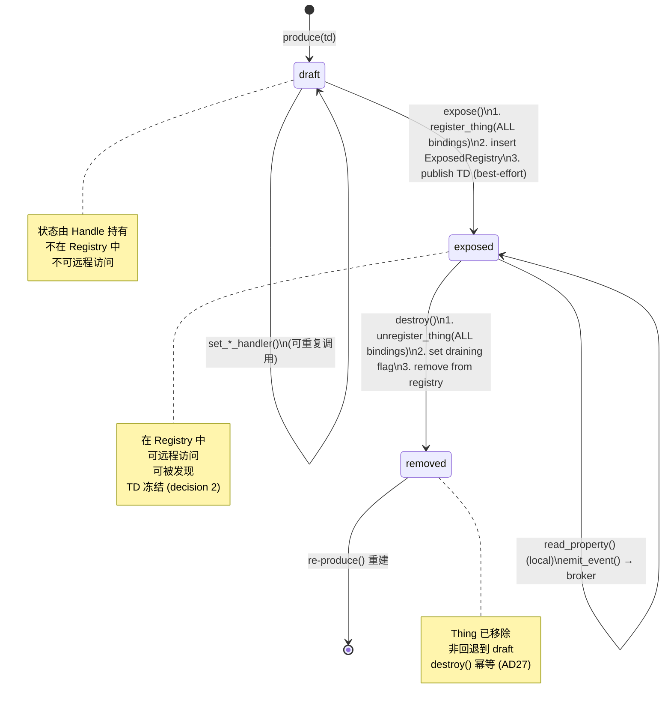

# Servient 工作流程图

> 基于 v4.0 baseline §7 / phase-p3 实现代码绘制。
>
> **Status update (post-c03de58, post-P0–P3):** 驱动循环已从 Servient 移除
> （commit c03de58）。Servient 现在只暴露 `Dispatch::serve_request(req).await`
> 给 binding 调用；每个 binding 自行决定驱动模型（fan-in channel / async
> route handler / super-loop `try_accept`）。原 §3 "poll_serve 驱动循环" 和
> §6 "驱动原语 × Feature 矩阵" 已重写。`ProtocolBinding` 统一外壳（P0）让
> 应用代码不再直接接触 `ServerBinding`/`ClientBinding`。

## 1. 全景架构

```
┌─────────────────────────────────────────────────────────────────────┐
│                         Servient                                    │
│                                                                     │
│  ┌─────────────┐  ┌──────────────┐  ┌───────────────────────────┐  │
│  │  Exposed    │  │  Consumed    │  │  Arc<dyn Discoverer>      │  │
│  │  Registry   │  │  Registry    │  │  (LocalDiscoverer / 注入)  │  │
│  │ WotLock<BM> │  │ WotLock<BM>  │  └───────────────────────────┘  │
│  └──────┬──────┘  └──────┬───────┘                                  │
│         │                │                  ┌───────────────────┐   │
│  ┌──────┴────────────────┴────────┐         │  EventBroker      │   │
│  │     Inbound Fan-In Channel      │         │  (事件扇出)        │   │
│  │  async_channel(capacity)        │         │                   │   │
│  │  Receiver ◄──── Sender clones   │         │  PublisherSink[]  │   │
│  └───────────────┬─────────────────┘         └───────────────────┘  │
│                  │                                                   │
│  ┌───────────────┴──────────────────────────────────────────────┐   │
│  │  Server Bindings (Arc<[...]> snapshot)                       │   │
│  │  ┌──────────────┐  ┌──────────────┐  ┌──────────────┐       │   │
│  │  │ Binding 1    │  │ Binding 2    │  │ Binding N    │       │   │
│  │  │ (zenoh)      │  │ (http...)    │  │              │       │   │
│  │  │ set_request_ │  │              │  │              │       │   │
│  │  │ sink(sender) │  │              │  │              │       │   │
│  │  └──────────────┘  └──────────────┘  └──────────────┘       │   │
│  └──────────────────────────────────────────────────────────────┘   │
│                                                                     │
│  Client Factories    │  Shutdown Flag    │  Rotation Cursor        │
│  Arc<[Factory]>      │  Arc<AtomicBool>  │  Arc<AtomicUsize>      │
└─────────────────────────────────────────────────────────────────────┘
```

## 2. Producer 生命周期：produce → expose → serve → destroy



## 3. 入站派发（binding-驱动 → dispatch → reply）

> **重写注记**：v4.0 baseline 原本把入站驱动循环放在 Servient 上
> （`poll_serve` / `serve` / `poll_serve_once`）。commit c03de58 把它移除：
> 驱动现在是 **binding-owned**。Servient 只实现 `Dispatch::serve_request`，
> 每个 binding 按自己的传输特性选择怎么调它。

```
   Remote Consumer                 Server Binding                   Servient
   ───────────────                 ──────────────                   ────────
        │                               │                              │
        │  zenoh get / put / query      │                              │
        ├──────────────────────────────►│                              │
        │                               │ 同步回调 (不能 .await)         │
        │                               │ fanin_tx.try_send(req)       │
        │                               │   ↓ (binding 自己的 draining  │
        │                               │       task 从 channel recv)  │
        │                               │ serve_request(req).await     │
        │                               ├─────────────────────────────►│
        │                               │                              │
        │                               │                  ┌───────────┤
        │                               │                  │ Dispatch │
        │                               │                  │ ::serve_ │
        │                               │                  │ request  │
        │                               │                  │   ↓      │
        │                               │                  │ Registry│
        │                               │                  │ lookup  │
        │                               │                  │   ↓      │
        │                               │                  │ draining?│
        │                               │                  │   ↓      │
        │                               │                  │ Exposed  │
        │                               │                  │ Thing    │
        │                               │                  │ .read_   │
        │                               │                  │ property│
        │                               │                  │ (sync)  │
        │                               │                  │   ↓      │
        │                               │                  │ Inbound │
        │                               │                  │ Response│
        │                               │                  └────┬─────┘
        │                               │                       │
        │                               │  ◄────────────────────┤
        │                               │  (returned to caller)  │
        │                               │   ↓                    │
        │                               │  binding 把 response    │
        │                               │  映射回 zenoh reply     │
        │  zenoh reply (CorrelationId)  │  (matched by            │
        │  ◄────────────────────────────┤   CorrelationId)        │
        │                               │                       │
```

不同 binding 的驱动模型对照：

| Binding 类型 | 如何调 `serve_request` |
|---|---|
| zenoh (sync 回调) | binding 自己 owns channel + draining task，从 channel `recv().await` 后调 `serve_request(req).await` |
| HTTP / CoAP (async handler) | route handler 里直接 `serve_request(req).await`，连接池提供 backpressure |
| bare no_std (无 executor) | super-loop 轮询 `binding.try_accept()`，然后调 `Dispatch::serve_request`（同步派发）+ `binding.send_response(resp)` |

## 4. 出站消费流（consume → interact）

```
  Application                 ConsumedThingHandle            Core Binding
  ───────────                 ────────────────────            ───────────
       │                              │                           │
       │ consume(td)                  │                           │
       ├─────────────────────────────►│                           │
       │                              │ ClientBindingFactory      │
       │                              │ .build() × N              │
       │                              │ → ConsumedThing           │
       │ ◄────────────────────────────┤ (handle created)          │
       │                              │                           │
       │ read_property("status",opts) │                           │
       ├─────────────────────────────►│                           │
       │                              │ affordance_form()         │
       │                              │ (select form for op)      │
       │                              │    ↓                      │
       │                              │ ConsumedThing::request()  │
       │                              │ .await                    │
       │                              │    ↓                      │
       │                              │ binding.supports()?       │
       │                              │    ↓                      │
       │                              │ binding.invoke(req)       │
       │                              │ .await                    │
       │                              ├──────────────────────────►│
       │                              │                           │ zenoh get/put
       │                              │                           │ (real network)
       │                              │                           │    ↓
       │                              │ ◄─────────────────────────┤
       │                              │ InteractionOutput         │
       │ ◄────────────────────────────┤                           │
       │ InteractionOutput            │                           │
```

## 5. 发现流程（discover → lazy session）

```
  Application              Servient              Discoverer           DirectoryReader
  ───────────              ────────              ──────────           ───────────────
       │                       │                      │                    │
       │ discover(filter)      │                      │                    │
       ├──────────────────────►│                      │                    │
       │                       │ discoverer.discover  │                    │
       │                       ├─────────────────────►│                    │
       │                       │ ◄────────────────────┤                    │
       │                       │ ThingDiscovery       │                    │
       │                       │ Process(Pending)     │                    │
       │ ◄─────────────────────┤                      │                    │
       │                       │                      │                    │
       │  (sync 返回, 无网络工作 — AD10 惰性)          │                    │
       │                       │                      │                    │
       │ process.next().await  │                      │                    │
       ├──────────────────────►│                      │                    │
       │                       │    Pending → Open    │                    │
       │                       │ reader.open_search() │                    │
       │                       ├─────────────────────────────────────────►│
       │                       │ ◄────────────────────────────────────────┤
       │                       │    DirectorySession  │                    │
       │                       │    .next().await     │                    │
       │                       │           ↓          │                    │
       │                       │    yield Thing       │                    │
       │ ◄─────────────────────┤                      │                    │
       │ Ok(Some(Thing))       │                      │                    │
       │                       │                      │                    │
       │ process.next().await  │                      │                    │
       ├──────────────────────►│    (drain complete)  │                    │
       │ ◄─────────────────────┤                      │                    │
       │ Ok(None)              │                      │                    │
```

## 6. Binding-owned 驱动模型 × Feature 矩阵

> **重写注记**：原 §6 描述 Servient 上的 `poll_serve`/`serve`/`poll_serve_once`
> 原语 × feature 矩阵。这些原语已删除（commit c03de58）。下表描述当前
> binding-owned 模型。

```
┌──────────────────────┬─────────────────────┬──────────────────────┬───────────────────────────┐
│ Binding driving      │ std (tokio)         │ no_std + async       │ bare no_std               │
│ model                │                     │ (embassy)            │ (no executor)             │
├──────────────────────┼─────────────────────┼──────────────────────┼───────────────────────────┤
│ fan-in channel       │ ✅ binding spawns   │ ✅ (embassy task)    │ ❌ 需要 executor           │
│ (zenoh sync 回调)    │   draining task     │                      │                           │
│                      │   recv().await      │                      │                           │
│                      │   → serve_request   │                      │                           │
├──────────────────────┼─────────────────────┼──────────────────────┼───────────────────────────┤
│ direct dispatch      │ ✅ route handler    │ ✅ (embassy async)   │ ❌ 需要 executor           │
│ (HTTP/CoAP async)    │   serve_request     │                      │                           │
│                      │   .await            │                      │                           │
├──────────────────────┼─────────────────────┼──────────────────────┼───────────────────────────┤
│ poll try_accept      │ ✅ (备选)            │ ✅ (备选)             │ ✅ 主路径                  │
│ (bare no_std super-  │                     │                      │ super-loop:               │
│  loop)               │                     │                      │   if let Some(req) =      │
│                      │                     │                      │     binding.try_accept()  │
│                      │                     │                      │   let resp = dispatch     │
│                      │                     │                      │     ::serve_request(req)  │
│                      │                     │                      │   binding.send_response   │
│                      │                     │                      │     (resp)                │
└──────────────────────┴─────────────────────┴──────────────────────┴───────────────────────────┘

bare no_std super-loop 用法:
  loop {
      if let Some(req) = binding.try_accept() {
          let resp = dispatch.serve_request(req).await;  // 或 sync dispatch
          binding.send_response(resp);
      }
      // ... 其他 super-loop 工作（传感器读数、子设备轮询）
  }
```

## 7. destroy() Quiescing（AD15）

```
  destroy() 调用
       │
       ▼
  ┌─────────────────────────────────────┐
  │ 1. unregister_thing(ALL bindings)   │  routes-first: 新请求无法到达
  └──────────────┬──────────────────────┘
                 ▼
  ┌─────────────────────────────────────┐
   │ 2. set draining = true              │  已入队的请求被拒绝
   │    Dispatch::serve_request 检查:     │  → "Thing gone" 错误回复
   │    if draining → error response     │
  └──────────────┬──────────────────────┘
                 ▼
  ┌─────────────────────────────────────┐
  │ 3. In-flight handlers 完成          │  已在执行的 handler 不取消
  │    (结果丢弃 if Thing 已移除)        │  async handler 不被 cancel
  └──────────────┬──────────────────────┘
                 ▼
  ┌─────────────────────────────────────┐
  │ 4. remove from ExposedRegistry      │  quiesce point: 无 in-flight
  └──────────────┬──────────────────────┘
                 ▼
  ┌─────────────────────────────────────┐
  │ 5. DirectoryPublisher::unregister   │  best-effort
  │    (v1 MVP: 无 publisher)            │
  └─────────────────────────────────────┘

  特殊: destroy(own_id) from handler
    → step 3 是当前 handler 自身
    → 延迟移除: handler 返回后才执行 step 4
```
