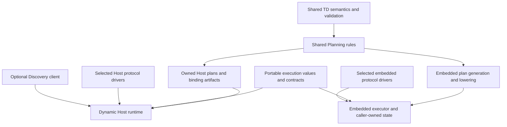

# Architecture Review 07: Product Roles, Platform Targets, and Crate Architecture

- Date: 2026-10-08
- Review ID: architecture-review-07-product-runtime-architecture
- Status: completed independent assessment; recommendation requires separate acceptance and any necessary authority migration
- Reviewed implementation: [`6e804d2d46ffc6a1a59b316f7e6e729cf0277512`](https://github.com/yushun1990/clinkz-wot/tree/6e804d2d46ffc6a1a59b316f7e6e729cf0277512)
- Reviewed authority: v5.1 Consumer one-shot authority, including ADR-0021

This is a non-normative architectural decision review. Its observations refer
to the revision above. It records evidence, a selected recommendation,
counterarguments, and migration criteria; it does not amend accepted
specifications, admit implementation, or change work-package or gate status.
The report belongs in `docs/reviews/` under the artifact responsibilities in
[the workspace guidance](../../workspace/README.md). Proposed changes remain
subject to [architecture change control](../../ARCHITECTURE_GOVERNANCE.md).

## Decision

Preserve **one authoritative implementation of WoT semantics and Planning
rules**, while allowing independently deployable Host and embedded execution
implementations with different storage, synchronization, and scheduling.
For fixed embedded applications, make build-time Planning a supported direction;
retain on-device dynamic admission as an optional capability where an actual
deployment needs it and its resource envelope is demonstrated.

Use a general dynamic Host runtime as the primary integration path for
gateways and applications that encounter previously unknown Things. Support
embedded firmware through selected Producer and/or Consumer capabilities,
caller-owned execution state, and platform progress. A complete dynamic WoT
runtime is not the minimum product for every role or platform.

This is an incremental refinement, not evidence for an immediate runtime
rewrite. The current target already shares its Property Read compiler and
distinguishes typed static execution from Host erasure. Its separate Host and
static runtime state machines also mean that the premise of one complete
shared runtime implementation is not a description of the present code.
The strongest opportunity is to make dependency and representation boundaries
match those existing distinctions, while finishing the Consumer integration.

Preserve the accepted ownership principles: TD owns effective meaning;
Planning owns selection and immutable output; bindings own protocol execution;
Servient owns admission, publication, activation, correlation, and cleanup.
Preserve generation checks, sealed Consumer results, explicit route activation,
and bounded progress where promised. Shared source does not require identical
physical runtime representations.

## Applications before platforms

The following are minimum capabilities for concrete applications, rather than
a requirement that every application expose every WoT operation.

| Application / role | Minimum required capabilities | Is a complete dynamic runtime necessary? |
| --- | --- | --- |
| TD editor, validator, generator, catalog tool | TD model, parsing/serialization where needed, extensions, Basic/schema validation, defaults, security expressions and URI meaning. Planning only for tools that check or produce executable configurations. | No. It should be usable without protocol I/O, handlers, registries, schedulers or Discovery. |
| Producer, such as a sensor or actuator | The advertised affordances, handlers, selected server protocol, payload/security enforcement, route activation and teardown. Observation/emission only if advertised. | No. A fixed Producer can execute compiled routes and publish a generated or externally hosted TD. Consumer, dynamic TD ingestion and Discovery are independent choices. |
| Consumer, such as a dashboard or controller | Selected outbound operations, credentials/security, response validation, correlation, cancellation and failure handling; subscriptions only when used. | Dynamic admission and Planning are needed for previously unknown TDs. A fixed peer/controller can use precompiled plans. Neither case inherently needs Producer support or every operation family. |
| Intermediary, such as a protocol proxy or digital twin adapter | Upstream Consumer and downstream Producer capabilities, mapping, separate trust boundaries, correlation, backpressure and lifecycle coordination. | Fixed mappings can be preplanned. Changing topology or arbitrary incoming TDs favors dynamic admission. Intermediary behavior is an application composition, not a reason to enable every runtime subsystem. |
| Gateway / industrial Linux service | The selected roles across many devices and protocols, isolation, concurrency, lifecycle and operational visibility; optional discovery/provisioning. Persistence, Directory service and industrial control policy are separate application responsibilities. | A general dynamic Host runtime is a credible default. A fixed industrial adapter can still preplan. Linux alone does not imply a Directory service, scripting engine or all protocols. |
| Embedded firmware | The selected Producer/Consumer operations, protocol buffers and progress, application state, payload/security checks and predictable ownership. | Usually unnecessary for a fixed firmware configuration. Dynamic commissioning can justify on-device TD admission on a sufficiently capable device; that is a distinct measured product envelope. |

These choices are consistent with WoT's alternative implementations, including
native APIs and TDs describing existing devices. WoT does not require a
scripting runtime or one concrete Servient implementation on every device.
[WoT Architecture 1.1, section 8.8](https://www.w3.org/TR/2023/REC-wot-architecture11-20231205/#alternative-servient-and-wot-implementations)
supports this distinction; the product allocation above is this review's
architectural judgment, not a claim that the standard prescribes these crates.

## Evidence boundary

The review inspected normal Cargo dependencies, feature projections, public
exports, production callers, target and legacy implementations, work-package
authority, architecture fixtures and focused executable probes. Documentary
targets and test-local adapters are not counted as shipped production paths.

| Area | Demonstrated at the reviewed revision | Limit of the evidence |
| --- | --- | --- |
| TD authoring and semantics | Production typed TD model and synchronous semantic kernels. The admitted `validated-thing` capability constructs an opaque, move-only borrowed `ValidatedThing<'td>` using shared Basic semantics and bounded typed inspection. | The new proof does not yet provide the complete production semantic-lending/Planning/Servient transaction. Ordinary serde construction is not bounded external JSON ingestion. |
| Consumer Core and leaf Planning | Registered completed Consumer call-value/result-validation tranche, exact-coordinate Property Read Planning leaf, and dual-role binding execution tranche. | Narrow production components exercised by tests are not a complete consumed-Thing facade. `PlanBuildInput::new(&Thing, ...)` is not a sealed validation proof or the proposed aggregate boundary. |
| Producer target integration | Static and public Host-erased Property Read lifecycle, independently accepted narrow architecture gate, and real Linux Zenoh round trips through a test-local target adapter. | The adapter is architecture feedback. It is not WP-600 product migration, a complete multi-owner scheduler, or evidence for every affordance and protocol. |
| Legacy application runtime | Public consume/produce handles, async dispatch, collections, security application and concrete Host Zenoh integration exist. | Their execution ownership and repeated TD interpretation differ from the target. Their existence cannot establish target Consumer completion. |
| Constrained portability | Useful production surfaces and umbrella feature cells compile for `thumbv7em-none-eabihf`, with and without the async syntax feature. | Compilation establishes type/dependency reachability, not firmware construction through every API, RAM fit, flash, latency, cancellation bounds or protocol operation. |
| zenoh-pico | Rust platform-hook API and fake-hook tests. | No real C backend/firmware round trip or whole-runtime hardware measurement was found. The legacy client trait composition also fails a focused compile probe. |
| General product completion | Foundation package complete; WP-100/200/300/400 in progress; WP-500/600/700 planned in the reviewed DAG. | Completed narrow tranches and fixtures must not be promoted into broad package or v1 completion. |

The authoritative scope distinctions are recorded in the
[work-package DAG](../work-packages/index.toml),
[borrowed TD admission record](../work-packages/WP-100-consumer-validated-thing-admission.md),
[Producer aggregate](../work-packages/PROPERTY-READ-ARCHITECTURE.md), and
[roadmap](../../PLAN.md). The
[borrowed-admission construction investigation](../../workspace/0075-consumer-borrowed-admission-construction.md)
explicitly identifies its private prototype's fixed envelopes and missing
production joins. Those limits remain relevant even when a component shares
production source or produces a real Core plan.

## Actual Cargo and feature boundaries

There are ten product crates, in addition to validation and fixture tools.
The following are normal dependencies, not an inference from crate names.

| Product crate | Direct architectural dependencies / consequence |
| --- | --- |
| Foundation | No normal dependencies. Its build script reads the repository-owned resource CSV; publishing is disabled until packaging preserves that source. |
| TD | Foundation plus the TD/serde/URI/time dependency set. It can already be used independently of execution. |
| Core | Foundation and TD; unconditional `critical-section`; optional async syntax primitives. TD-bearing legacy things, security contexts and operation types share this crate with target execution values. |
| Planning | Foundation, TD and Core. The Property Read compiler algorithm is shared across static and Host registration representations. |
| Protocol binding utilities | Core and TD. The existing utility surface is also part of the legacy runtime dependency chain. |
| Zenoh binding | Core, TD and binding utilities; the concrete Host backend adds Zenoh and Tokio. Planning and Servient are dev dependencies for target probes. |
| Servient | Foundation, Core, TD, Planning, Discovery and binding utilities. Concrete Zenoh is an optional normal dependency selected by `test-zenoh`. |
| Discovery | Core and TD, including legacy in-memory directory/service behavior. |
| CBOR codec | Core, which transitively brings TD even for the payload/codec contract. |
| Umbrella | Always Core, TD, Discovery, binding utilities and Servient; codecs and concrete Zenoh are optional. |

Sources: [workspace manifest](../../Cargo.toml),
[Core manifest](../../core/Cargo.toml),
[Planning manifest](../../planning/Cargo.toml),
[Servient manifest](../../servient/Cargo.toml),
[Discovery manifest](../../discovery/Cargo.toml),
[binding manifest](../../protocol-bindings/protocols/zenoh/Cargo.toml),
[codec manifest](../../codecs/cbor/Cargo.toml), and
[umbrella manifest](../../clinkz-wot/Cargo.toml).

Isolated normal dependency trees produced these package counts. Each count
includes the selected root and unique transitive packages, excludes dev/build
edges, uses the locked graph, and disables default features before adding the
listed feature. Counts are a dependency-surface observation, not executable
size or retained RAM.

| Selected package / added feature | Packages | Tokio in normal graph? |
| --- | ---: | --- |
| TD | 29 | No |
| Core | 31 | No |
| Core + `async` | 39 | No |
| Planning | 32 | No |
| Servient | 36 | No |
| Umbrella | 37 | No |
| Umbrella + `std` | 48 | No |
| Umbrella + `zenoh` | 321 | Yes |

Several boundaries already work well. Core's `std` and `async` axes are
orthogonal, and the portable async syntax surface does not select an executor.
The typed TD proof explicitly gates its arbitrary-precision Number access.
These should be retained. Some comments in Servient and the umbrella still
associate `std` with Tokio, but the graph shows that concrete Zenoh selects it.

The remaining coupling is concrete:

- A Consumer-only or fixed Producer application using the umbrella inherits
  Discovery and the combined Servient dependency surface. Link-time removal
  may reduce an image, but does not create an independent API/build boundary.
- A codec or lightweight binding author using Core inherits TD dependencies
  and legacy runtime types. This is more than importing `Operation`:
  [security contexts](../../core/src/security.rs) refer to TD objects and
  [legacy things](../../core/src/thing.rs) retain them.
- `test-zenoh` is named like a test facility but enables a concrete normal
  dependency from Servient. Target probes currently rely on dev-side reverse
  dependencies instead of a migrated production binding composition.
- [The Zenoh crate](../../protocol-bindings/protocols/zenoh/src/lib.rs) rejects
  enabling `zenoh` and `zenoh-pico` together. This makes backend choice a crate
  graph constraint; applications combining different targets/backends cannot
  assume ordinary additive feature composition. Separating compiler support
  from runtime backends is a credible later remedy.
- [Foundation packaging](../../foundation/Cargo.toml) depends on a CSV outside
  its crate directory through [the generator](../../foundation/build.rs).
  Release packaging needs to include that authoritative input or its
  reproducibly generated projection, without creating a second editable schema.

## Production call paths and duplication

### Legacy Consumer and target Planning are separate paths

The public path is currently:

```text
Servient::consume(Thing)
  -> legacy ConsumedThing retaining Arc<Thing> and binding/security collections
  -> handle operation selects the first matching Form and clones it into Arc
  -> ConsumedThing::request checks TD membership/effective operations/security
  -> legacy Zenoh invoke validates the operation again and calls plan_for
  -> protocol execution
```

See [consume](../../servient/src/servient.rs),
[handle selection](../../servient/src/handle.rs),
[ConsumedThing request](../../core/src/thing.rs), and
[Zenoh invocation/cache](../../protocol-bindings/protocols/zenoh/src/zenoh.rs).
Repeated checks call shared semantic helpers, so they are not all independent
semantic algorithms. They are nevertheless duplicated execution work and a
second selection/lifecycle path beside the target compiler pipeline.

The target is also intentionally narrow despite generic type names:
[`LogicalInteractionPlan::operation`](../../core/src/plan.rs) returns
`ReadProperty`, and the leaf compiler's `compiler_work_is_portable` currently
accepts compiler work declarations only in `BindingPolls`. This is useful
Property Read evidence, not a demonstrated general planner for every operation
or binding compiler workload.

The Zenoh cache uses Form allocation identity and `Weak<Form>`. A small external
probe ran two public reads through a capturing transport while retaining both
returned plan Arcs. It printed:

```text
calls=2, same_plan_allocation=false
```

This agrees with the source: each handle read creates a fresh Form Arc, so this
public path does not reuse the first cached plan. Keeping the first plan alive
rules out allocator address reuse in the comparison. The observation is scoped
to this path; callers retaining and reusing one Form Arc can exercise a different
cache behavior. It is not a network latency measurement.

Legacy `read_all_properties` performs per-property reads, and
`subscribe_all_events` starts per-event subscriptions and merges them. These
are real conveniences, but are not the target's native root collection plan
and single binding driver. Migration must explicitly preserve, replace or
deprecate their public behavior rather than assume equivalence.

### Public Core exposes two generations

[Core exports](../../core/src/lib.rs) include legacy `ClientBinding`,
`ServerBinding`, `Dispatch`, `ConsumedThing`, `ExposedThing` and event machinery
alongside new plan, binding, slot and lifecycle types. The root async
`core::ClientBinding` and the newer Host `core::binding::ClientBinding` are
different traits. This is an API migration issue as well as dependency coupling;
renaming modules without an explicit compatibility boundary would not resolve it.

The newer [poll binding contracts](../../core/src/binding.rs) use typed
caller-owned state and do not impose the legacy client trait's blanket
thread-safety requirement. That is a sound embedded boundary to preserve.

### Producer coexistence still retains legacy costs

`Servient::produce` is legacy. The narrow target `produce_td` installs a clone
of the TD into the Property Read owner and also constructs a legacy
`ExposedThing` from the original. The target facade therefore has migration
storage costs beyond its plans and artifacts.

The legacy [server path](../../servient/src/servient.rs) calls security
providers and synchronous handlers inside `slot.with_read`. On `no_std`,
[WotLock](../../core/src/sync.rs) executes that closure in a critical section.
The actual call path does not support the lock module's broad comment that
critical sections never span handler dispatch. This is a concrete legacy
coupling; it does not demonstrate that the new Property Read poll contract
violates its callback/lock invariant.

The legacy concrete Zenoh backend also drives dispatch through spawned Tokio
tasks. That is separate from target engine-owned progress. Removing one
runtime without mapping these ownership and availability differences risks
behavioral regressions.

### Host and static execution already differ

[Property Read Servient](../../servient/src/property_read.rs) contains
`StaticPropertyReadServient` and `HostPropertyReadRuntime`, with separate
step/destroy/cleanup orchestration and representation-specific ownership.
Both use the shared [Property Read compiler](../../planning/src/property_read.rs)
and common contract helpers. Host erasure and cleanup transfer justify some
differences; a shared scheduler is not automatically simpler.

The Host owner has `Mutex<Option<HostPropertyReadRuntime>>` and a narrow
installation/configuration path. The static cell is likewise a narrow proof.
Neither is evidence of the complete general multi-Thing, multi-route runtime.
As they expand, duplicated transition decisions require shared invariant
predicates and conformance traces where useful, rather than forcing identical
buffer layouts or synchronization.

### Registration is currently Producer-centered

The first [static registration](../../core/src/binding.rs) requires a server
component. Producer-only validation rejects Consumer capability; the later
`StaticBindingComponents<S, C>` path adds Consumer execution to a dual-role
bundle. Host registration likewise requires Producer capability and a server
component while accepting an optional client component.

The [Consumer binding admission](../work-packages/WP-300-bindings.md) deliberately
limits the first slice to that extension. This is valid scoped evidence, not
proof that a Consumer product requires a server. A successor must allow a
genuine client-only registration without dummy servers, while preserving
complete registration identity, compiler compatibility and result sealing.
It need not reopen the completed dual-role slice now.

### Discovery is not yet the target client-only dependency

[ServientBuilder](../../servient/src/builder.rs) defaults to `LocalDiscoverer`
backed by `InMemoryDirectory`. Legacy Discovery therefore includes service
behavior even when a product did not request a Directory service. The roadmap's
client-only boundary is a migration target, not an accurate description of
that implementation. Make Discovery a selected client capability and move
Directory hosting into separate application/service composition.

## Portability and resource-model costs

### `no_std` is not a small-device runtime guarantee

[Payload](../../core/src/payload.rs) owns `Arc<[u8]>` and String metadata;
identities and WotLock also use Arc. Consequently the current Core requires
pointer-width atomics even when async is disabled. The `thumbv6m-none-eabi`
compiler configuration reports no `target_has_atomic="ptr"`;
[Rust's Arc documentation](https://doc.rust-lang.org/alloc/sync/index.html)
explains the corresponding availability condition. This review inspected that
target configuration; it did not compile a complete Cortex-M0 firmware.

The public dynamic Servient builder is std-only. A successful portable async
compile does not by itself establish public construction of that dynamic
runtime on a bare-metal application. The static builder is a useful public
surface, but currently owns a Thing and allocation-bearing names/configuration;
typed static dispatch is not synonymous with allocation-free construction.

An external trait-bound probe also attempted:

```rust
use clinkz_wot_protocol_bindings_zenoh::{ZenohBindingTransport, ZenohPicoTransport};
fn requires_client<T: clinkz_wot_core::ClientBinding>() {}
fn main() { requires_client::<ZenohBindingTransport<ZenohPicoTransport>>(); }
```

With `async,zenoh-pico` and defaults disabled, it fails with E0277:
`ZenohPicoTransport` contains `RefCell<Box<dyn ZenohPicoPlatform>>`, while the
legacy generic client implementation requires `Send + Sync`. This disproves
that specific composition, not the feasibility of a new typed poll-based Pico
binding. The [platform hooks](../../protocol-bindings/protocols/zenoh/src/runtime/zenoh_pico.rs)
leave real session, C calls, progress and buffer ownership to the integrator;
fake-hook tests cannot settle those questions. Adding unsafe thread-safety
claims would not be an architectural fix.

### Inline size experiment

An external `size_of` probe used Rust 1.99.0 (`b940084d7`, 2026-09-28), TD's
`validated-thing` feature, and defaults disabled. The Host column adds the
Foundation/TD/Core/Planning/Servient `std` features; the Cortex-M4 column uses
`thumbv7em-none-eabihf` without those features. Sizes were printed on Host and
read from an exported size array in target assembly.

| Type | 64-bit Host bytes | Cortex-M4 bytes |
| --- | ---: | ---: |
| `ResourceLimits` | 3,136 | 3,136 |
| `AdmissionLedger` | 176 | 176 |
| `ResourceAccount` | 40 | 40 |
| `WorkBudget` | 96 | 96 |
| `CoreError` | 232 | 232 |
| `ErrorContext` | 184 | 184 |
| `Payload` | 64 | 32 |
| `LogicalInteractionPlan` | 104 | 56 |
| `PlanBuildOutput<()>` | 72 | 36 |
| `Thing` | 808 | 420 |
| `ValidatedThingAdmissionConfig` | 320 | 320 |
| `ValidatedThingCursor<'static>` | 1,032 | 808 |
| `StaticServientBuilder<(), ()>` | 3,992 | 3,600 |

These are inline layout observations, not peak stack, heap, flash or WCET.
Nested values must not be double-counted; Vec/Box/Arc allocations are excluded.
The local toolchain differs from mainline's pinned Rust 1.95.0, so these are not
release ABI or target acceptance claims.

[ResourceLimits](../../foundation/src/resource.rs) stores 196 `Option<u64>`
entries. The complete schema is useful as authoritative policy, but carrying
its entire physical table in every runtime configuration is not a semantic
necessity. The borrowed TD config already projects a smaller applicable set.
CoreError's 96-byte cause buffer is only part of its 232-byte value; WorkBudget
has twelve u64 counters. These costs may be acceptable, but propagate through
cursors, results, slots and error paths and need explicit device accounting.

The static implementation still uses allocation-bearing plans/artifacts and
`Vec<ResourceAccount>` reservations. Its local resource mechanisms should not
be presented as complete atomic parent/global accounting across simultaneous
owners. The latter remains a production Consumer assembly obligation.

### The constrained reference profile is not a demonstrated board fit

[The performance manifest](../performance/constrained.toml) identifies an
STM32F407 with 128 KiB SRAM plus 64 KiB CCM, marks `runtime_default=false`, and
defines workload/measurement contracts. The
[resource CSV](../resource-limits.csv) gives its reference profile, among other
ceilings, 64 KiB document bytes, 4 MiB engine live bytes, 4 MiB admission peak,
1 MiB admission temporary bytes and a 256 KiB largest allocation.

Those are ceilings, not eager allocations or reservations. They nevertheless
cannot certify that all accepted maxima fit this board; the largest-allocation
ceiling exceeds its total stated RAM even before bank restrictions. No measured
whole-runtime hardware result was found in the inspected repository evidence.
Keep schema/profile meaning separate from actual device support. Device
profiles should project applicable limits and be calibrated against simultaneous
application, engine, protocol and allocator use.

## Credible alternatives

| Alternative | Strongest argument | Assessment |
| --- | --- | --- |
| Require one complete dynamic runtime on Linux and constrained MCUs | One application model, one admission path, no generated-image compatibility layer; plausible on larger MCUs with an allocator. | Inferior as a universal product requirement. Fixed firmware pays for capabilities it does not need, and current shared types impose atomics/allocation/TD coupling. Nothing measured here proves it impossible on every MCU; retain it as an optional supported envelope. |
| Separate Host and embedded libraries that each implement WoT semantics and Planning | Maximum local optimization and independent delivery. | Reject semantic/planner forks. Defaults, security, URI resolution, selection and validation would drift, and every fix would need parallel implementation/evidence. |
| Shared semantic libraries and Planning, with distinct execution representations | One meaning and selection policy; Host concurrency and embedded storage/progress can be chosen independently. | Recommended. It introduces lowering/adapter and conformance obligations, but addresses concrete dependency costs without requiring a semantic rewrite. |
| Build-time Planning for every product | Removes dynamic TD admission from execution and makes fixed storage predictable. | Useful embedded mode, insufficient for gateways/Consumers discovering unknown TDs after deployment. It complements the Host path. |
| Retain current architecture and finish migration first | The accepted target already separates semantic owners, immutable plans, typed slots and Host erasure. Much observed coupling is legacy coexistence or deliberately narrow first slices. | Strongest counterargument. Retain its semantic and ownership architecture and current Consumer critical path. Change deployment/representation requirements incrementally; the evidence does not justify replacing the entire design before the first target Consumer works. |

The recommendation can be falsified. If a realistic fixed embedded application
demonstrates acceptable whole-device memory/progress/protocol behavior with the
existing dynamic runtime, and dependency extraction or generated artifacts
create more complexity than they remove, keeping that runtime is preferable
for that device class. Conversely, a dependency-only compile or fixture with
mock transport cannot settle that trade-off.

## Recommended target boundaries

The following is a responsibility model, not a demand for one new crate per
box or a frozen new public API.



1. **TD semantics remain singular.** Keep Basic/schema/default/security/URI
   rule implementations and the bounded proof/lending authority in TD. Typed
   authoring, future strict ingestion and build tools can use different source
   storage while sharing that meaning. Do not reopen the removed mandatory
   normalized Snapshot for the typed Consumer path.
2. **Planning remains singular.** Reuse one selection/compiler-barrier program
   for runtime and build-time use. Owned Host output may use Vec/Box; embedded
   lowering may produce static strings, indices, fixed arrays and concrete
   binding records. Lowering must preserve the same effective operations,
   security expressions, URI targets, schema rules and selected coordinates.
3. **Execution contracts shed authoring dependencies.** A smaller execution
   crate, or a slimmer Core with explicit compatibility modules, should expose
   IDs, operation/result contracts, slots, generation checks and binding
   progress without depending on Thing/Form parsing or Discovery. Extract only
   boundaries justified by real consumers, preserving public reexports during
   migration. Runtime payload validation and security enforcement still apply.
4. **Host and embedded own their physical mechanisms.** Host may use shared
   ownership, erasure and async orchestration. Embedded may use borrowed/static
   data, fixed capacity and explicit platform progress. Share invariant checks
   and algorithms where they simplify both, but test observable semantics and
   lifecycle outcomes rather than demand identical schedulers or layouts.
5. **Protocol and role composition are selected.** Permit client-only,
   server-only and dual-role products. Split a binding compiler from concrete
   runtime backends where needed to keep build-time dependencies out of
   firmware. Discovery is optional; a Directory service is separate.

Build-time Planning requires a trusted construction boundary. The current
`HostBindingArtifact(Box<dyn Any + Send + Sync>)` is not a serializable firmware
image or stable ABI. Do not freeze arbitrary erased objects or dump in-memory
plans. Generate concrete supported artifact data/code through the shared
compiler and a reviewed lowering interface. Record semantic/compiler/binding
compatibility and target/profile assumptions; create fresh runtime
registration/configuration generations when binding the image. Credentials,
live handles, response validation, cancellation and protocol resource ownership
remain runtime concerns.

Dynamic embedded admission remains an optional composition of shared TD and
Planning with the embedded executor. Dropping TD/Planning from a fixed
firmware's normal dependency graph must be demonstrated after extraction; it
is not an existing capability claimed by this report.

## Migration with minimum Consumer Property Read disruption

| Stage | Recommended scope | Evidence / disruption boundary |
| --- | --- | --- |
| 1. Review the product allocation | Independently assess this recommendation and identify any exact requirement that forces a universal representation or mandatory dynamic capability. Amend only conflicting contracts; where existing authority already permits the allocation, retain it. | Reaffirm semantic owners, generation/lifecycle/resource invariants and existing narrow evidence. A review report alone grants no new implementation scope or architecture reset. |
| 2. Finish the admitted Consumer transaction | Continue production TD semantic lending, aggregate Planning preflight/materialization and the Servient join under ADR-0021. Preserve all bounds before compiler starts, owned source-independent output, parent/global allowance pairing and atomic publication. | Do not insert code generation or a crate rewrite into this critical path. Keep existing static/Host compile obligations and completed leaf/dual-role contracts. |
| 3. Exercise the actual Host Consumer | Follow the aggregate with real Host Zenoh through the new public target Consumer path, with repeat reads and failure/cancel cleanup. | Demonstrate that application calls reach frozen plans instead of legacy per-call Form interpretation. Test-local Producer feedback and legacy Host success cannot replace this evidence. |
| 4. Extract deployment boundaries incrementally | Move execution-only values/contracts out of TD-bearing legacy surfaces; preserve reexports and compatibility paths. Make Discovery optional, separate Directory hosting, and review client-only registration and backend dependency changes as successor scopes. | Each step must have a real application dependency/API benefit and focused compile/runtime evidence. Preserve one resource schema during packaging. Avoid a simultaneous workspace-wide rename. |
| 5. Prove one fixed embedded product | Use the same semantic/Planning implementation to produce one precompiled Producer or fixed Consumer. Bind concrete typed artifacts into an embedded executor with explicit buffers/progress. | Show a firmware normal graph without TD/Planning, real Pico/C or another real protocol operation, and whole-device flash/RAM/stack/latency/cancellation evidence. Compare against the dynamic option for the same application. |
| 6. Expand from observed needs | Add dynamic embedded commissioning, additional operation families, multi-owner scheduling or further protocols where product use requires them. | Require measured envelopes and conformance for the added capability. Do not infer general support from the first firmware or Zenoh-family proof. |

The immediate recommended technical action is **to complete the admitted
Consumer TD semantic-lending and aggregate transaction boundary**, while
reviewing product allocation and any necessary representation amendment
independently. Potentially affected owners are architecture data flows and
module boundaries, Foundation/resource and Core contracts, Planning, binding
SPI, Servient lifecycle, the relevant work packages, API ownership,
profile/performance projections and affected evidence. Migrate only owners
whose contracts actually change; do not open a broad documentation reset.
Only change roadmap ordering if the adopted decision actually changes a
durable dependency.

Migration risks include lifetime and public facade changes from owning consume
to borrowed admission; accidental broadening of raw-Thing Planning entry;
Host/static cleanup drift; compiler/artifact version mismatch; role identity
changes; lossy native collection migration; incorrect parent/global accounting;
and generated images that omit runtime security or payload validation. Keep
old and target paths distinguishable until each public capability has a tested
replacement and an explicit compatibility/removal decision.

## Unknowns requiring external evidence

- **Whole firmware costs:** simultaneous engine/application/C-stack/network
  buffers, flash, peak stack, allocator fragmentation, largest usable RAM bank,
  interrupt blocking and worst progress/cancellation delay on real hardware.
- **Real Pico execution:** C buffer ownership, callback/progress integration,
  timeouts, reconnect, cancellation and retained cleanup under failure. Fake
  hooks and the legacy trait-bound failure do not determine a viable adapter.
- **Protocol neutrality:** a materially contrasting protocol shape, such as
  HTTP, CoAP or MQTT, exercising the same engine ownership contracts. Host
  Zenoh and zenoh-pico remain one protocol family.
- **Sustained composition:** multi-Thing global admission, fairness, route
  isolation, subscription overflow and shutdown with concurrent owners.
- **Deployment need:** whether an actual firmware must accept arbitrary new TDs
  after deployment or can be provisioned with known peers/routes. This affects
  which optional product to support, not whether to duplicate WoT semantics.

## Reproduction and validation record

Focused checks performed for this review passed:

```sh
cargo test --offline --locked -p clinkz-wot-td --features validated-thing --test validated_admission --quiet
cargo test --offline --locked -p clinkz-wot-servient --test property_read --quiet
cargo test --offline --locked -p clinkz-wot-protocol-bindings-zenoh --test target_property_read_feedback_probe --quiet -- --test-threads=1
cargo check --offline --locked -p clinkz-wot --no-default-features --target thumbv7em-none-eabihf
cargo check --offline --locked -p clinkz-wot --no-default-features --features async --target thumbv7em-none-eabihf
```

The three selected test binaries ran 7, 11 and 7 tests respectively. The last
test binary uses real Linux protocol round trips, within its test-local target
binding scope. These were focused review checks, not a local full-workspace
rerun, embedded runtime acceptance or independent gate-state change.

To reproduce a dependency cell, replace the package and optional feature in:

```sh
cargo tree --offline --locked -p clinkz-wot --no-default-features --features std -e normal --prefix none
```

Count unique output lines after removing Cargo's trailing ` (*)` marker. Use
isolated package commands rather than an all-workspace feature-unified graph.

The temporary external experiments did not patch repository source or add
production/test artifacts. They can be reconstructed in a scratch Cargo
project as follows:

- For sizes, depend on Foundation, TD (`validated-thing`), Core, Planning and
  Servient by path with defaults disabled. Forward their `std` features for
  Host. Export a `#[unsafe(no_mangle)] pub static REVIEW_SIZES: [usize; 13]`
  containing `core::mem::size_of::<T>()` for the table's types in table order.
  Print on Host; compile the no-std library with
  `cargo rustc --offline --lib --target thumbv7em-none-eabihf -- --emit=asm`
  and inspect the exported 13-word array. This measures layouts without
  executing firmware or requiring an embedded allocator.
- For the Pico trait check, add the Zenoh crate with defaults disabled and
  `async,zenoh-pico`, then compile the snippet above. The expected failure is
  the legacy `Send + Sync` requirement, not a link or network error.
- For the cache experiment, enable Host Servient/Core async, supply a
  `ZenohTransport` whose `execute` retains each `request.plan` in
  `Arc<Mutex<Vec<Arc<ZenohOperationPlan>>>>` and returns JSON `42`; register a
  `ZenohBindingTransport::with_transport` client. Consume one no-security TD
  with a numeric property and a `zenoh+tcp` read Form, call the public
  `read_property` twice, then compare the two retained plans with
  `Arc::ptr_eq`. No network backend is required for this selection/cache probe.

The measurements and compile counterexample support the specific coupling
findings. They do not establish that a complete dynamic runtime cannot fit a
larger MCU, or that a generated embedded executor is already implemented.
