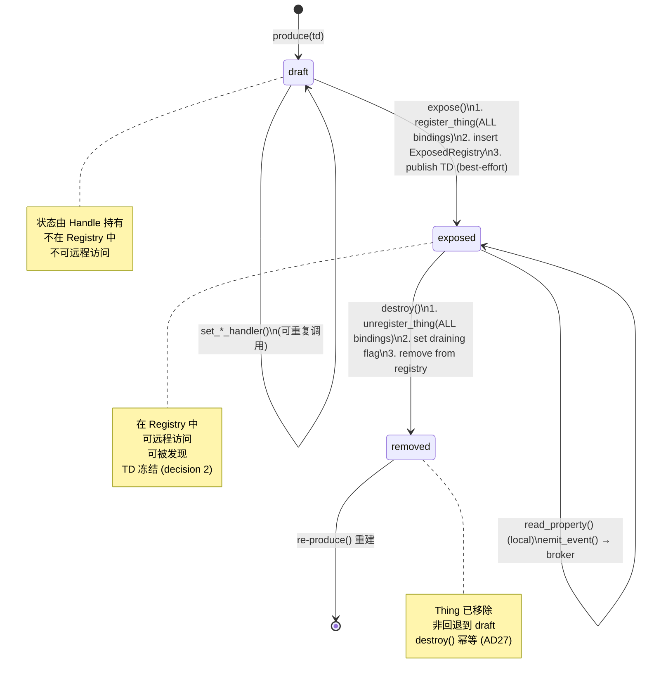

# Servient 工作流程图

> 基于 v4.0 baseline §7 / phase-p3 实现代码绘制。

## 1. 全景架构

```
┌─────────────────────────────────────────────────────────────────────┐
│                         Servient                                    │
│                                                                     │
│  ┌─────────────┐  ┌──────────────┐  ┌───────────────────────────┐  │
│  │  Exposed    │  │  Consumed    │  │  Arc<dyn Discoverer>      │  │
│  │  Registry   │  │  Registry    │  │  (LocalDiscoverer / 注入)  │  │
│  │ WotLock<BM> │  │ WotLock<BM>  │  └───────────────────────────┘  │
│  └──────┬──────┘  └──────┬───────┘                                  │
│         │                │                  ┌───────────────────┐   │
│  ┌──────┴────────────────┴────────┐         │  EventBroker      │   │
│  │     Inbound Fan-In Channel      │         │  (事件扇出)        │   │
│  │  async_channel(capacity)        │         │                   │   │
│  │  Receiver ◄──── Sender clones   │         │  PublisherSink[]  │   │
│  └───────────────┬─────────────────┘         └───────────────────┘  │
│                  │                                                   │
│  ┌───────────────┴──────────────────────────────────────────────┐   │
│  │  Server Bindings (Arc<[...]> snapshot)                       │   │
│  │  ┌──────────────┐  ┌──────────────┐  ┌──────────────┐       │   │
│  │  │ Binding 1    │  │ Binding 2    │  │ Binding N    │       │   │
│  │  │ (zenoh)      │  │ (http...)    │  │              │       │   │
│  │  │ set_request_ │  │              │  │              │       │   │
│  │  │ sink(sender) │  │              │  │              │       │   │
│  │  └──────────────┘  └──────────────┘  └──────────────┘       │   │
│  └──────────────────────────────────────────────────────────────┘   │
│                                                                     │
│  Client Factories    │  Shutdown Flag    │  Rotation Cursor        │
│  Arc<[Factory]>      │  Arc<AtomicBool>  │  Arc<AtomicUsize>      │
└─────────────────────────────────────────────────────────────────────┘
```

## 2. Producer 生命周期：produce → expose → serve → destroy



## 3. 入站驱动循环（poll_serve → dispatch → reply）

```
  Remote Consumer                 Server Binding                  Servient
  ───────────────                 ──────────────                  ────────
       │                               │                             │
       │  zenoh get / put / query      │                             │
       ├──────────────────────────────►│                             │
       │                               │  同步回调 (不能 .await)       │
       │                               │  fanin_tx.try_send(req)     │
       │                               ├────────────────────────────►│
       │                               │         FanIn Channel       │
       │                               │         (bounded)           │
       │                               │                             │
       │                               │                  ┌──────────┤
       │                               │                  │poll_serve│
       │                               │                  │()        │
       │                               │                  │          │
       │                               │                  │ recv()   │
       │                               │                  │ .await   │
       │                               │                  │    ↓     │
       │                               │                  │ dispatch │
       │                               │                  │ (req)    │
       │                               │                  │    ↓     │
       │                               │                  │ Registry │
       │                               │                  │ lookup   │
       │                               │                  │    ↓     │
       │                               │                  │ draining?│
       │                               │                  │    ↓     │
       │                               │                  │ Exposed  │
       │                               │                  │ Thing    │
       │                               │                  │ .read_   │
       │                               │                  │ property │
       │                               │                  │ (sync)   │
       │                               │                  │    ↓     │
       │                               │                  │ Inbound  │
       │                               │                  │ Response │
       │                               │                  └────┬─────┘
       │                               │                       │
       │                               │       for each binding│
       │                               │  ◄────────────────────┤
       │                               │  send_response(resp)   │
       │                               │  (matched by           │
       │                               │   CorrelationId)       │
       │  zenoh reply (CorrelationId)  │                       │
       │  ◄────────────────────────────┤                       │
       │                               │                       │
```

## 4. 出站消费流（consume → interact）

```
  Application                 ConsumedThingHandle            Core Binding
  ───────────                 ────────────────────            ───────────
       │                              │                           │
       │ consume(td)                  │                           │
       ├─────────────────────────────►│                           │
       │                              │ ClientBindingFactory      │
       │                              │ .build() × N              │
       │                              │ → ConsumedThing           │
       │ ◄────────────────────────────┤ (handle created)          │
       │                              │                           │
       │ read_property("status",opts) │                           │
       ├─────────────────────────────►│                           │
       │                              │ affordance_form()         │
       │                              │ (select form for op)      │
       │                              │    ↓                      │
       │                              │ ConsumedThing::request()  │
       │                              │ .await                    │
       │                              │    ↓                      │
       │                              │ binding.supports()?       │
       │                              │    ↓                      │
       │                              │ binding.invoke(req)       │
       │                              │ .await                    │
       │                              ├──────────────────────────►│
       │                              │                           │ zenoh get/put
       │                              │                           │ (real network)
       │                              │                           │    ↓
       │                              │ ◄─────────────────────────┤
       │                              │ InteractionOutput         │
       │ ◄────────────────────────────┤                           │
       │ InteractionOutput            │                           │
```

## 5. 发现流程（discover → lazy session）

```
  Application              Servient              Discoverer           DirectoryReader
  ───────────              ────────              ──────────           ───────────────
       │                       │                      │                    │
       │ discover(filter)      │                      │                    │
       ├──────────────────────►│                      │                    │
       │                       │ discoverer.discover  │                    │
       │                       ├─────────────────────►│                    │
       │                       │ ◄────────────────────┤                    │
       │                       │ ThingDiscovery       │                    │
       │                       │ Process(Pending)     │                    │
       │ ◄─────────────────────┤                      │                    │
       │                       │                      │                    │
       │  (sync 返回, 无网络工作 — AD10 惰性)          │                    │
       │                       │                      │                    │
       │ process.next().await  │                      │                    │
       ├──────────────────────►│                      │                    │
       │                       │    Pending → Open    │                    │
       │                       │ reader.open_search() │                    │
       │                       ├─────────────────────────────────────────►│
       │                       │ ◄────────────────────────────────────────┤
       │                       │    DirectorySession  │                    │
       │                       │    .next().await     │                    │
       │                       │           ↓          │                    │
       │                       │    yield Thing       │                    │
       │ ◄─────────────────────┤                      │                    │
       │ Ok(Some(Thing))       │                      │                    │
       │                       │                      │                    │
       │ process.next().await  │                      │                    │
       ├──────────────────────►│    (drain complete)  │                    │
       │ ◄─────────────────────┤                      │                    │
       │ Ok(None)              │                      │                    │
```

## 6. 驱动原语 × Feature 矩阵

```
┌────────────────┬──────────────┬───────────────────┬───────────────────────┐
│ Primitive      │ std (tokio)  │ no_std + async    │ bare no_std           │
│                │              │ (embassy)         │ (no executor)         │
├────────────────┼──────────────┼───────────────────┼───────────────────────┤
│ poll_serve     │ ✅ recv().await│ ✅ (embassy)     │ ❌ 不存在              │
│ (async)        │   → dispatch  │                   │                       │
├────────────────┼──────────────┼───────────────────┼───────────────────────┤
│ serve          │ ✅ loop until │ ✅ (embassy task) │ ❌ 不存在              │
│ (async loop)   │   shutdown    │                   │                       │
├────────────────┼──────────────┼───────────────────┼───────────────────────┤
│ poll_serve_once│ ✅            │ ✅ 存储可复用      │ ✅ 纯同步              │
│ (sync)         │              │ poll_serve future │ try_accept 轮询游标   │
│                │              │ 每轮 poll 同一个   │ → sync dispatch       │
│                │              │ future (E2)       │ → send_response       │
└────────────────┴──────────────┴───────────────────┴───────────────────────┘

Bare no_std super-loop 用法:
  loop {
      let waker = noop_waker();
      let mut cx = Context::from_waker(&waker);
      let _ = svc.poll_serve_once(&mut cx);
      // ... 其他 super-loop 工作（传感器读数、子设备轮询）
  }
```

## 7. destroy() Quiescing（AD15）

```
  destroy() 调用
       │
       ▼
  ┌─────────────────────────────────────┐
  │ 1. unregister_thing(ALL bindings)   │  routes-first: 新请求无法到达
  └──────────────┬──────────────────────┘
                 ▼
  ┌─────────────────────────────────────┐
  │ 2. set draining = true              │  已入队的请求被拒绝
  │    poll_serve dispatch 检查:         │  → "Thing gone" 错误回复
  │    if draining → error response     │
  └──────────────┬──────────────────────┘
                 ▼
  ┌─────────────────────────────────────┐
  │ 3. In-flight handlers 完成          │  已在执行的 handler 不取消
  │    (结果丢弃 if Thing 已移除)        │  async handler 不被 cancel
  └──────────────┬──────────────────────┘
                 ▼
  ┌─────────────────────────────────────┐
  │ 4. remove from ExposedRegistry      │  quiesce point: 无 in-flight
  └──────────────┬──────────────────────┘
                 ▼
  ┌─────────────────────────────────────┐
  │ 5. DirectoryPublisher::unregister   │  best-effort
  │    (v1 MVP: 无 publisher)            │
  └─────────────────────────────────────┘

  特殊: destroy(own_id) from handler
    → step 3 是当前 handler 自身
    → 延迟移除: handler 返回后才执行 step 4
```
